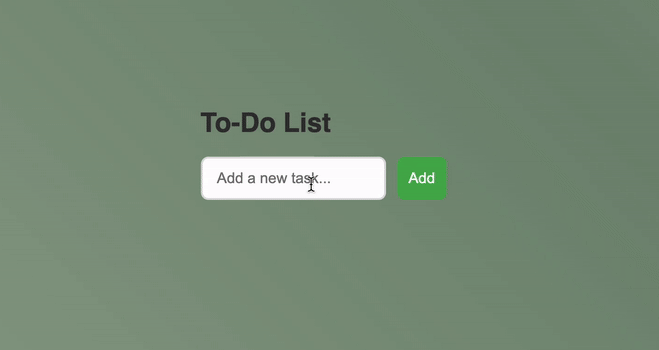

# Task List App

## Description
This is a simple **Task List App** built with **HTML**, **CSS**, and **JavaScript**. It allows users to add tasks, mark them as completed, and delete tasks. The app features a modern design with a moving wave background and responsive interface. 

---

## Snapshot


---

## Features

- **Add New Task**: You can enter a task and add it to your list.
- **Mark Task as Completed**: Tasks can be marked as completed by clicking on them and crossing them out.
- **Delete Task**: Tasks can be deleted from the list.
- **Persistent Tasks**: The app uses **localStorage** to save tasks, ensuring that they are preserved even after closing the page or refreshing the browser.
- **Responsive Design**: The app is designed to work across different screen sizes and devices.
- **Animated Background**: The background features a soothing moving wave animation with a sage color scheme.

---

## Technologies Used

- **HTML**: For structuring the content and layout of the app.
- **CSS**: For styling the app, including a responsive design and animations.
- **JavaScript**: For the logic of adding, completing, and deleting tasks dynamically.
- **Flexbox**: Used for aligning and positioning elements in a clean and responsive way.

---

## Installation

1. **Clone the repository**:
   ```bash
   git clone https://github.com/DianaSill/task-list-app.git

2. **Navigate to the Project Folder**:
After cloning, navigate to the project directory:
    ```bash
    cd task-list-app

3. **Open index.html file in your browser**:
No additional setup is required. Simply open the index.html file in your preferred web browser to run the app.

---

## How It Works

1. **Adding a Task**: 
   - Enter the task name in the input field and click the "Add Task" button.
   - The task will be added to the task list below. Each task will display with a "Delete" button and will be clickable to mark it as completed.

2. **Marking a Task as Completed**: 
   - Click on the task text to mark it as completed.
   - Once clicked, the task will appear with a line through it to indicate that it's completed.
   
3. **Deleting a Task**: 
   - Each task has a "Delete" button next to it.
   - Clicking the "Delete" button will remove the task from the list.

---

## Future Improvements

- **Editing Tasks**: 
  - Add the ability for users to edit tasks after they have been added. For example, provide an "Edit" button next to each task that allows users to modify the task's text.

- **Categorizing Tasks**: 
  - Implement the ability to categorize tasks into different groups (e.g., "Work", "Personal", "Shopping"). This could involve adding tags or dropdown menus for each task.

- **Sorting Tasks**: 
  - Allow tasks to be sorted by name, creation date, or completion status. This can make it easier for users to organize and prioritize their tasks.

- **User Interface Enhancements**: 
  - Add more interactive animations, transitions, or visual effects (e.g., fade-in/fade-out effects for tasks, smooth transitions when tasks are added or deleted).

- **Mobile App**: 
  - Convert the task list into a mobile app using frameworks like React Native or Flutter, or use Progressive Web App (PWA) techniques to make it available offline.

- **User Authentication**: 
  - Introduce user accounts to allow users to save tasks across multiple devices. This could be done by integrating user authentication with services like Firebase or using a custom back-end.
